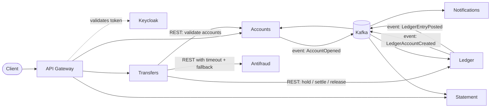

# KiPay

[Versão em português](README.md)

KiPay is a microservices digital wallet where account holders open accounts, receive deposits, transfer money to each
other and check their statements. It is a portfolio project that showcases real financial-system decisions
(consistency, idempotency, sagas and auditability), not just an accounts CRUD.

> **Status: under construction.** Phase 0 (repository foundation: documentation, ADRs and OpenSpec) is in progress.
> There is no service code yet; services start in Phase 1.

## Planned architecture

The diagram shows the **target** architecture. None of these services is implemented yet.

Core decision: every money movement between internal accounts happens inside the Ledger, in a single ACID
transaction.

## Planned stack

Java 25 · Spring Boot 4.1 (virtual threads) · Spring Cloud · PostgreSQL (one per service) · Keycloak · Kafka ·
Maven monorepo · OpenAPI · Docker Compose, then Kubernetes · Spec-Driven Development with OpenSpec.

## Roadmap

Phase 0 (in progress): repository foundation. Planned: account opening, simulated deposits, edge and identity,
internal transfers (saga), statement (CQRS), notifications, antifraud, full observability, simulated Pix, daily
reconciliation, platform and deploy, and an AI assistant.

## Documentation

The detailed documentation (constitution, architecture overview, domain concepts and ADRs) is written in
Brazilian Portuguese, while all code is in English. See the [Portuguese README](README.md#documentação) for links
and the [pt-BR → English glossary](docs/dominio/glossario.md) for the names used in code.
