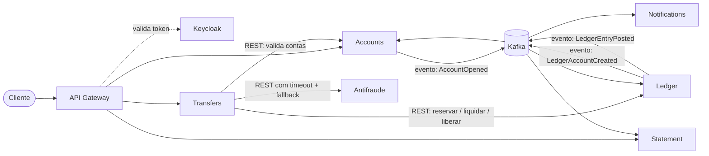

# KiPay

[English version](README.en.md)

KiPay é uma carteira digital em microserviços em que titulares abrem conta, recebem depósitos, transferem dinheiro
entre si e consultam o extrato. É um projeto de portfólio que demonstra decisões reais de sistemas financeiros
(consistência, idempotência, sagas e auditabilidade), não apenas um CRUD de contas.

> **Status: em construção.** A Fase 0 (fundação do repositório: documentação, ADRs e OpenSpec) está em andamento.
> Ainda não existe código de serviço; os serviços nascem a partir da Fase 1.

## Arquitetura planejada

O diagrama abaixo mostra a arquitetura **alvo**, descrita em detalhe na [visão geral](docs/arquitetura/visao-geral.md).
Nenhum destes serviços está implementado ainda.

Decisão central: todo movimento de dinheiro entre contas internas acontece dentro do Ledger, numa única transação
ACID ([ADR-0001](docs/adr/0001-movimentacao-de-dinheiro-no-ledger.md)).

## Stack prevista

| Item | Escolha |
|---|---|
| Linguagem | Java 25 |
| Framework | Spring Boot 4.1 (Spring Framework 7, Spring Security 7), virtual threads |
| Spring Cloud | Release train compatível com o Boot 4.x |
| Banco | PostgreSQL, um por serviço |
| Identidade | Keycloak (OAuth2 / OpenID Connect, JWT) |
| Mensageria | Kafka ([ADR-0003](docs/adr/0003-kafka-como-mensageria.md)) |
| Build | Maven, monorepo com um projeto por serviço ([ADR-0002](docs/adr/0002-monorepo-e-maven.md)) |
| Contratos | OpenAPI (springdoc) e schemas versionados de eventos |
| Execução local | Docker Compose; Kubernetes a partir da fase de plataforma |
| Especificação | Spec-Driven Development com [OpenSpec](https://github.com/Fission-AI/OpenSpec) |

## Roadmap

Cada fase vira uma mudança no OpenSpec, com proposta, specs, design e tarefas.

| Fase | Feature | Status |
|---|---|---|
| 0 | Fundação do repositório | Em andamento |
| 1 | Abertura de conta (Accounts e Ledger) | Planejada |
| 2 | Depósito simulado (cash-in) | Planejada |
| 3 | Borda e identidade (Keycloak e API Gateway) | Planejada |
| 4 | Transferência interna (saga) | Planejada |
| 5 | Extrato (CQRS) | Planejada |
| 6 | Notificações | Planejada |
| 7 | Antifraude | Planejada |
| 8 | Observabilidade completa | Planejada |
| 9 | Pix simulado | Planejada |
| 10 | Conciliação diária | Planejada |
| 11 | Plataforma e deploy | Planejada |
| 12 | Assistente com IA | Planejada |

## Documentação

- [Constituição](docs/constitution.md): princípios inegociáveis do projeto
- [Visão geral](docs/arquitetura/visao-geral.md): produto, bounded contexts, comunicação e consistência por operação
- [Conceitos do domínio](docs/dominio/conceitos-carteira-digital.md): carteira digital, livro-razão, Pix e conciliação
- [Glossário pt-BR → inglês](docs/dominio/glossario.md): nomes usados no código
- [ADRs](docs/adr/): decisões de arquitetura
  - [ADR-0001](docs/adr/0001-movimentacao-de-dinheiro-no-ledger.md): movimentação de dinheiro concentrada no Ledger
  - [ADR-0002](docs/adr/0002-monorepo-e-maven.md): monorepo com serviços Maven independentes
  - [ADR-0003](docs/adr/0003-kafka-como-mensageria.md): Kafka como único broker
  - [ADR-0004](docs/adr/0004-idioma-do-projeto.md): documentação em português, código em inglês
