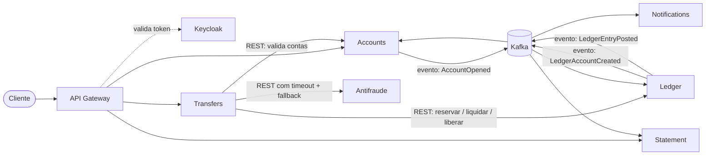

# Visão Geral — Carteira Digital

> Documento de produto e arquitetura em alto nível. Descreve **o quê** e **por quê**.
> O **como** de cada feature fica no plano/design da respectiva mudança.

## 1. Visão do produto

Uma carteira digital em que titulares abrem uma conta, recebem depósitos, transferem dinheiro entre si,
consultam o extrato e são notificados das movimentações. Em fases posteriores: antifraude, Pix simulado,
conciliação diária e um assistente com IA.

**Objetivo do projeto**: projeto de portfólio que demonstra decisões reais de sistemas financeiros
(consistência, idempotência, sagas, auditabilidade), e não apenas um CRUD de contas.

### Fora de escopo

- Integração com o Banco Central ou com instituições reais (o Pix é simulado).
- Cartões, crédito, investimentos e câmbio.
- Aplicativo front-end completo (a API é o produto; um front simples pode vir depois).

## 2. Linguagem ubíqua (glossário)

| Termo | Significado |
|---|---|
| **Titular** | Pessoa física dona de uma conta. |
| **Conta** | Cadastro da conta do titular, com status (PENDENTE, ATIVA, BLOQUEADA, ENCERRADA). |
| **Conta contábil** | Representação da conta dentro do livro-razão, onde os lançamentos acontecem. |
| **Lançamento** | Registro imutável de débito ou crédito numa conta contábil. |
| **Saldo contábil** | Soma dos lançamentos efetivados. |
| **Saldo disponível** | Saldo contábil menos os valores reservados. |
| **Reserva (hold)** | Valor bloqueado temporariamente durante uma transferência em andamento. |
| **Liquidação** | Efetivação da transferência: a reserva vira débito e o destino recebe o crédito. |
| **Estorno** | Lançamento que anula outro, mantendo o histórico. |
| **Chave de idempotência** | Identificador enviado pelo cliente para que uma operação repetida não tenha efeito duplicado. |

## 3. Bounded contexts e serviços

| Serviço | Responsabilidade | Dados de que é dono | Fase |
|---|---|---|---|
| **Accounts** | Cadastro de titulares e contas; ciclo de vida da conta (status) | Titular, Conta | 1 |
| **Ledger** | Livro-razão: lançamentos, saldos, reservas, liquidação e estornos | Conta contábil, Lançamento, Reserva | 1 |
| **Transfers** | Orquestra a transferência (saga): valida, reserva, consulta antifraude, liquida ou compensa | Transferência e seus passos | 1 |
| **Statement** | Extrato e histórico (read model alimentado por eventos) | Visão de extrato | 2 |
| **Notifications** | Avisos de movimentação ao titular | Notificações enviadas | 2 |
| **Antifraude** | Score de risco da transferência | Regras e avaliações | 3 |
| **Pix** | Chaves Pix e transferência por chave (simulado) | Chaves | 5 |
| **Reconciliation** | Conciliação diária com Spring Batch | Relatórios de conciliação | 5 |
| **Assistant** | Assistente com Spring AI/RAG sobre extrato e dúvidas | Índice vetorial | 7 |

**Infraestrutura**: API Gateway, Keycloak, Config Server, Service Registry (depois Kubernetes), observabilidade (OpenTelemetry).

> Decisão central: todo movimento de dinheiro entre contas internas acontece **dentro do Ledger**, numa única
> transação ACID. A saga existe para coordenar os passos *ao redor* do dinheiro (validação, antifraude), não
> para mover dinheiro entre bancos de serviços diferentes. Ver ADR-0001.

## 4. Mapa de comunicação

- **Síncrono (REST)**: quando quem chama precisa da resposta para continuar (validar conta, reservar saldo).
- **Assíncrono (eventos)**: quando o interessado pode reagir depois (criar conta contábil, atualizar extrato, notificar).
- Evolução prevista: os comandos Transfers → Ledger passam de REST para mensagens no Kafka na fase de comunicação
  assíncrona. O Kafka é o único broker do projeto desde a fase 1 (ver ADR-0003).

## 5. Decisões de consistência por operação

| Operação | Escolha | Como | Comportamento na falha |
|---|---|---|---|
| Abrir conta | AP no cadastro, CP na ativação | Conta nasce PENDENTE; vira ATIVA ao receber `LedgerAccountCreated` | Conta permanece PENDENTE e não movimenta dinheiro |
| CPF único | CP | Restrição de unicidade no banco do Accounts | Recusa a segunda abertura |
| Depósito (cash-in simulado) | CP | Transação ACID no Ledger + idempotência | Recusa e permite nova tentativa |
| Reservar saldo | CP | Transação ACID + lock otimista na conta contábil | Recusa a transferência (saldo insuficiente ou conflito) |
| Liquidar transferência | CP | Débito e crédito na mesma transação no Ledger | Reserva continua ativa; saga tenta de novo ou libera |
| Coordenar a transferência | Eventualmente consistente | Saga orquestrada no Transfers, com compensação | Compensação: liberar reserva |
| Score antifraude | AP com timeout | Chamada com timeout e circuit breaker | Fallback conservador: aprova valores baixos, segura valores altos |
| Extrato | AP | Read model atualizado por eventos | Mostra dados com alguns segundos de atraso |
| Notificações | AP | Tópico + tópicos de retry + DLT | Entrega atrasada |
| Conciliação diária | Consistência no fim do dia | Spring Batch | Reprocessa a partir do último ponto confirmado |

## 6. Roadmap de features (cada uma vira uma mudança no OpenSpec)

| Ordem | Feature | O que nasce na arquitetura | Conceitos revisados |
|---|---|---|---|
| 0 | Fundação do repositório | Repositório, documentação, OpenSpec | SDD, ADR |
| 1 | Abertura de conta | Accounts e Ledger, PostgreSQL por serviço, Kafka, Outbox, Docker Compose, CI | Database per Service, coreografia, consistência eventual, consumidor idempotente, unicidade |
| 2 | Depósito simulado (cash-in) | Núcleo do Ledger: lançamentos e saldo | Partidas dobradas, idempotência, ACID, saldo nunca negativo |
| 3 | Borda e identidade | Keycloak, API Gateway, Service Registry, Config Server | Access Token Pattern, JWT/JWKS, dupla validação, Service Discovery |
| 4 | Transferência interna | Transfers | Saga orquestrada, reserva, compensação, Resilience4j |
| 5 | Extrato | Statement | CQRS, eventos, Outbox |
| 6 | Notificações | Notifications | Consumidores idempotentes, retry e DLT |
| 7 | Antifraude | Antifraude | Circuit breaker, timeout, fallback consciente (AP vs CP) |
| 8 | Observabilidade completa | OpenTelemetry e dashboards | Traces, métricas, SLOs |
| 9 | Pix simulado | Pix e "SPI simulado" | Chaves, limites, particionamento e ordenação no Kafka |
| 10 | Conciliação diária | Reconciliation | Spring Batch, reprocessamento |
| 11 | Plataforma e deploy | Kubernetes, gestão de segredos, AWS | Deploy, Vault/Secrets Manager |
| 12 | Assistente | Assistant | Spring AI, RAG |

> A borda (Keycloak e Gateway) entra antes da transferência: a regra "o titular só acessa as próprias contas"
> (constituição, Artigo IX) se torna crítica quando o dinheiro passa a se mover entre pessoas, e incluí-la com
> apenas dois serviços prontos custa pouco.
